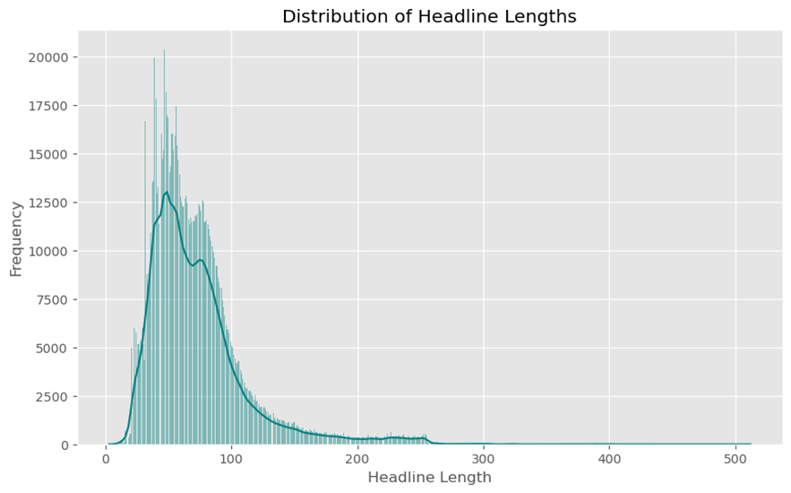
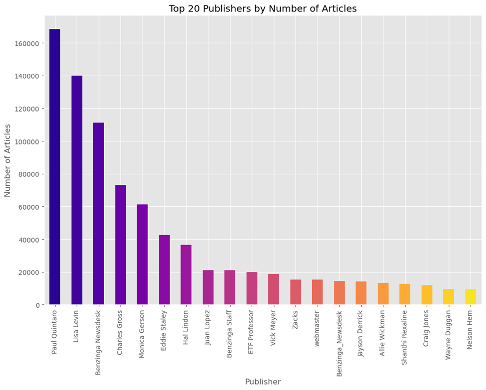
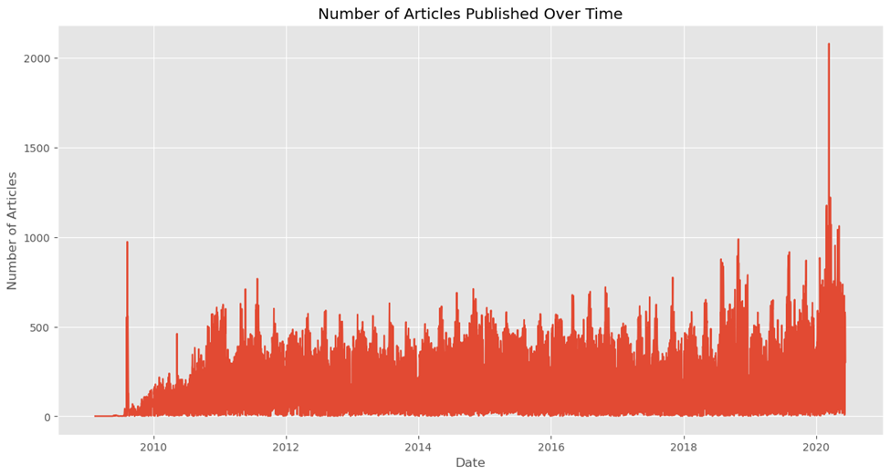
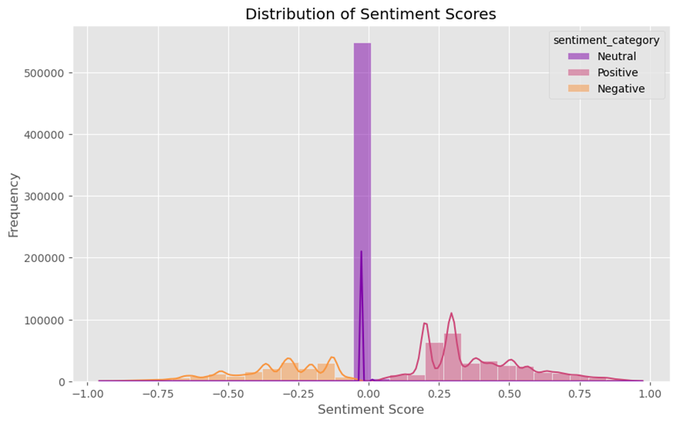
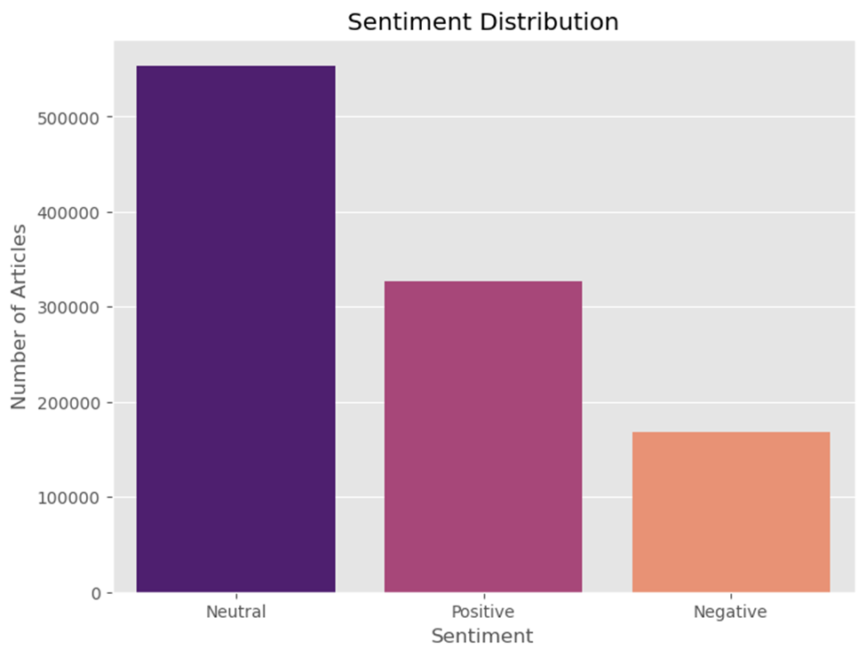
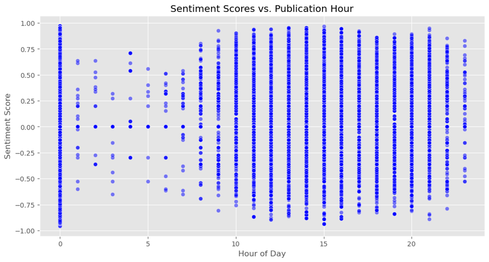
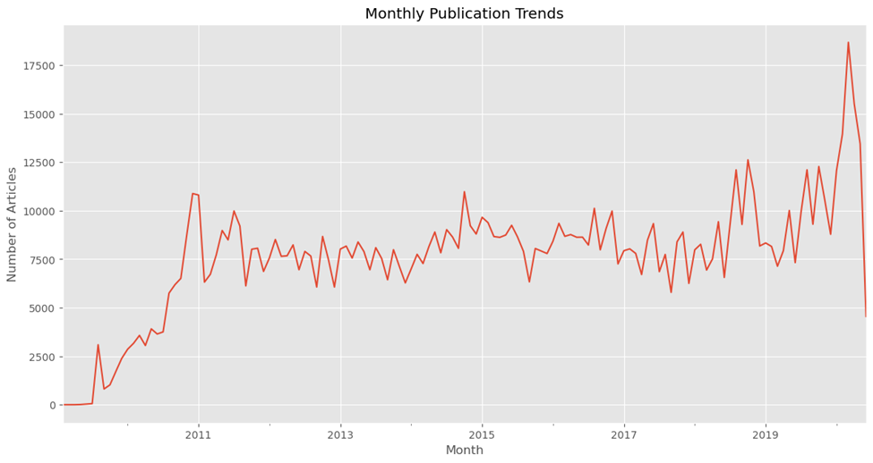
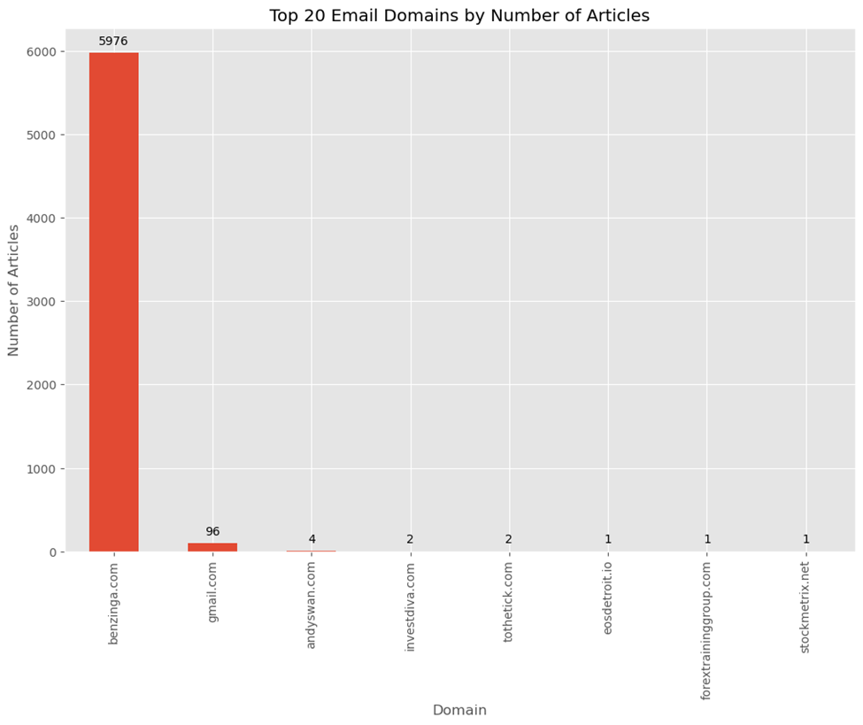

Sentiment Analysis of Financial News Report
Introduction
This report provides a comprehensive analysis of sentiment in financial news headlines, focusing on the application of natural language processing (NLP) techniques to gauge market sentiment. The primary objective is to analyze the sentiment associated with news articles over time and explore the relationships between sentiment and various market factors. 
	 
Methodology
The sentiment analysis of financial news was conducted using several key steps, which are outlined below:

1. Data Preprocessing
Data preprocessing is essential for preparing the textual data for sentiment analysis. The following tasks were performed:
Tokenization: Headlines were tokenized, breaking down the text into individual words or tokens, which are the building blocks for further analysis.
Sentiment Scoring: Each headline was assigned a sentiment score using a pre-trained sentiment analysis model or lexicon-based approach. Scores typically ranged from -1 (negative sentiment) to +1 (positive sentiment), with 0 representing neutral sentiment.

Exploratory Data Analysis (EDA)
Exploratory Data Analysis was conducted to explore the distribution of sentiment scores and their relationship with various factors
Descriptive Statistics
Basic statistical measures, such as mean, median, standard deviation, and range, were calculated for numerical variables. These statistics provided a summary of the central tendencies and variability within the data.
•	Peak Frequency: The most common headline lengths fall between 50 and 100 characters, where the frequency of headlines is the highest, peaking at around 20,000.
•	Skewed Distribution: The distribution is highly right-skewed, with a long tail extending towards longer headline lengths. This indicates that while most headlines are relatively short, there are some outliers with much longer lengths, though they are rare.

Fig1:  Histogram for the distribution of headline lengths, measured by the number of characters

The bar chart visualizes the top 20 publishers by the number of articles. Paul Quintaro and Lisa Levin are the top publishers, each with over 150,000 articles. They stand out significantly compared to the others, indicating a substantial contribution to the publication count.

Fig 2: The top 20 publishers by the number of articles

Fig 3: number of publications over time

Text Analysis (Sentiment analysis & Topic Modeling)
This plot illustrates the distribution of sentiment scores, categorized into three sentiment categories: Neutral, Positive, and Negative. The x-axis represents the sentiment scores, which range from -1 (most negative) to 1 (most positive). The y-axis represents the frequency of articles falling into each sentiment category.
General Interpretation
Neutral Sentiment Dominance: The high concentration around the neutral score suggests that a large proportion of the headlines or articles are either neutral in tone or the sentiment analysis tool might be assigning neutral scores to ambiguous or mixed content.
Diverse Sentiment Distribution: While neutral sentiment is prevalent, the presence of distinct peaks in positive and negative sentiments indicates that there is a variety of sentiment across the dataset, capturing different market events or news narratives.
Sentiment as a Continuous Variable: The distribution demonstrates that sentiment is treated as a continuous variable, ranging from -1 to 1. Each category (neutral, positive, negative) is derived based on where the sentiment scores fall on this continuous scale. This allows for a more nuanced analysis than simply categorizing articles as strictly positive, negative, or neutral without considering the degree of sentiment.

Fig 4:  sentiment score plot of financial news as continuous variable

Fig 5:  sentiment score plot of financial news as categorical variable

Topic Modeling
The topic modeling to cluster terms into distinct categories related to financial and stock market news are given below:
   Topic 0:
['new', 'stock', 'morning', 'benzinga', 'markets', 'shares', 'mid', 'announces', 'update', 'market']
Topic 1:
['q3', 'q1', 'q4', 'estimate', 'sees', 'sales', 'reports', 'eps', 'est', 'vs']
Topic 2:
['00', 'earnings', 'price', 'maintains', 'raises', 'target', 'upgrades', 'downgrades', 'buy', 'pt']
Topic 3:
['company', 'oil', 'analyst', 'earnings', 'lower', 'says', 'higher', 'companies', 'trading', 'shares']
Topic 4:
['market', 'day', 'new', 'yesterday', 'biggest', 'moving', 'session', '52', 'week', 'stocks']

Time Series Analysis
The scatter plot shows the relationship between sentiment scores (y-axis) and the hour of the day when the articles were published (x-axis). Key Observations:
Sentiment Score Distribution: The sentiment scores range from -1 (most negative) to 1 (most positive). There is a noticeable spread across the entire sentiment range at almost every hour, indicating that articles with various sentiment levels are published throughout the day.
Hour of Publication: The x-axis represents the hour of the day (from 0 to 23), indicating when the articles were published. The plot shows that articles are published at every hour, with certain hours appearing more densely populated.
Patterns and Clusters: Around Midnight (Hour 0): There is a dense concentration of points around hour 0, with a wide range of sentiment scores. This suggests a significant number of articles are published right around midnight, possibly due to scheduled releases or reports that are ready to go live at the start of the day.
During Working Hours (Hours 8-17): There is a consistent presence of articles being published during standard working hours. The distribution of sentiment scores remains broad, indicating that news of all sentiment types is regularly released during this time.
Late Evening (Hours 20-23): There is also a fair number of articles published in the late evening. The sentiment score distribution is less dense compared to working hours, but still shows a range of positive and negative sentiments.
General Interpretation:
Diverse Sentiment Throughout the Day: The plot reveals that there is no specific time when only positive or negative news is published; instead, a mix of sentiments is present throughout the day. This indicates that sentiment is not time-dependent but more likely tied to the content or nature of the news.
Concentration at Specific Times: The dense clusters around specific hours, like midnight and standard working hours, suggest times when news publications are more frequent. This might be linked to regular reporting schedules, market openings/closings, or other time-bound events.
No Clear Time-Sentiment Correlation: There doesn’t appear to be a strong correlation between the hour of the day and the sentiment score. The sentiment scores are distributed fairly evenly across different hours.
In summary, this plot shows that sentiment in news articles is broadly distributed across all hours of the day, with no specific time bias towards positive or negative sentiment.

Fig 6:  Monthly publication trends of articles over a period of time 

Key Observations: There is a clear upward trend in the number of articles published over time. The general trajectory indicates that more articles are being published as time progresses. Between 2010 and 2012, there is a rapid increase in the number of articles published, which may correspond to a period of heightened market activity or an expansion in the sources contributing to the dataset. After this initial surge, the number of articles seems to stabilize, albeit with fluctuations, until around 2019 when another notable increase occurs.
In summary, the plot indicates that the volume of financial news articles has generally increased over time, with some periods of significant growth and variability. The sharp changes in the most recent months warrant further investigation to understand whether they represent real-world events or anomalies in the data collection process.

Fig 7: Monthly publication trends over time for financial news from 2010 to 2019

Publication Analysis

Fig 8: The domain of publications for financial news

Summary
The sentiment analysis of financial news headlines revealed several key insights:
Prevalence of Neutral Sentiment: A significant portion of the headlines had neutral sentiment scores, suggesting that much of the financial news is factual and devoid of strong emotional language.

This report provides a comprehensive analysis of sentiment in financial news headlines. The findings underscore the importance of sentiment analysis in the financial industry and demonstrate how NLP techniques can be effectively utilized to gauge market sentiment and inform trading strategies.
